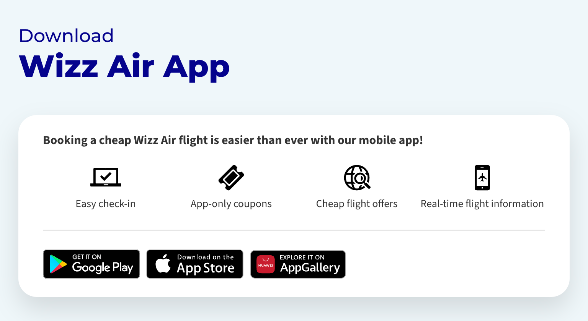

# Wizz Air App

Download Wizz Air App card challenge

## Instructions

1. All the text and images you need are inside the `index.html` file already;
2. Color codes (HEX): `#EFF7FA`, `#05038D`, `#E6E6E6`, `#343434`, `#FFFFFF`;
3. You can find visual examples inside the `examples` directory;
4. Use this fonts: [Montserrat](https://fonts.google.com/specimen/Montserrat "Title font"), [Source Sans 3](https://fonts.google.com/specimen/Source+Sans+3 "Text font");
5. Create `style.css` file and start your styling;
6. Good luck 🤞

## Examples

### Desktop

### Tablet

### Smartphone

